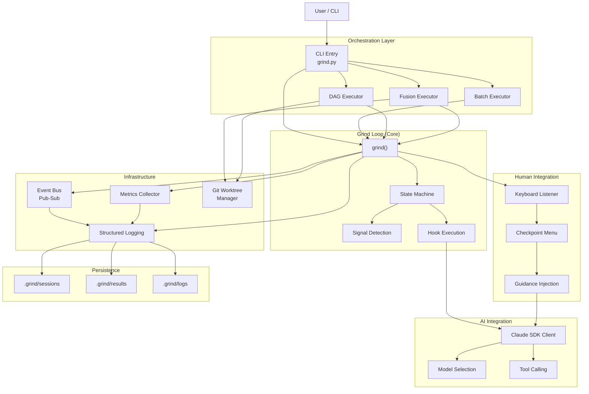

# Claude Code Agent - Orchestration Architecture Analysis

**Agent Orchestration Architect Analysis**
**Generated:** 2026-01-14
**Scope:** Multi-agent grind loop orchestration system design

---

## Executive Summary

The claude-code-agent codebase implements a sophisticated **iterative fix-verify orchestration system** built around the "grind loop" - a state machine that repeatedly queries AI agents, verifies results, and continues iterating. The system has evolved from a monolithic design to a modular, composable architecture supporting:

1. **Sequential grind loops** - Single task execution with state-driven iterations
2. **Batch execution** - Sequential multi-task runs with dependency tracking
3. **DAG execution** - Topologically sorted task graphs with parallel execution
4. **Fusion mode** - Multi-agent parallel execution with intelligent result combination
5. **Interactive checkpoints** - Human-in-the-loop validation at iteration boundaries
6. **Event-driven pub-sub** - Observable orchestration with metrics collection

**Architecture Pattern:** Hierarchical state machine with feedback loops, human integration points, and composable agent execution.

---

## 1. GRIND LOOP EXECUTION MODEL

### 1.1 Core Loop Architecture

```
INITIALIZATION
    ↓
PRE-GRIND HOOKS (optional slash commands)
    ↓
ITERATION LOOP (while iteration < max):
    ├─ SEND QUERY to Claude SDK
    ├─ PROCESS RESPONSE (collect text, tool calls, results)
    ├─ CHECK SIGNALS (GRIND_COMPLETE, GRIND_STUCK patterns)
    ├─ POST-ITERATION HOOKS (optional)
    ├─ INTERACTIVE CHECKPOINT (optional, human-triggered)
    └─ SEND CONTINUE PROMPT (if no signal)
    ↓
POST-GRIND HOOKS (optional)
    ↓
RETURN RESULT
```

**Key Insight:** The loop is **signal-driven** - it looks for explicit `GRIND_COMPLETE` or `GRIND_STUCK` patterns in agent output. Without these signals, it continues to the next iteration.

### 1.2 State Machine Definition

**States:**
- `Initializing` - Setup SDK client, keyboard listener, build system prompt
- `PreGrindHooks` - Execute pre-execution hooks
- `Iterating` - Main loop: query SDK → stream response → check signals
- `CheckingSignals` - Parse response for completion/stuck signals
- `PostIterationHooks` - Lifecycle hooks after each iteration
- `Checkpoint` - Interactive pause (human can abort, inject guidance, verify)
- `Complete` - Agent signaled GRIND_COMPLETE
- `Stuck` - Agent signaled GRIND_STUCK
- `MaxIterations` - Hit iteration limit
- `Error` - Exception occurred

**Terminal States:** Complete, Stuck, MaxIterations, Error

### 1.3 Result Capture (GrindResult)

```python
@dataclass
class GrindResult:
    status: GrindStatus                           # COMPLETE|STUCK|MAX_ITERATIONS|ERROR
    iterations: int                               # How many iterations ran
    message: str                                  # Completion or error message
    tools_used: list[str]                         # [Read, Write, Bash, etc.]
    duration_seconds: float                       # Wall clock time
    hooks_executed: list[tuple[str, str, bool]]   # (command, output, success)
    model: str                                    # "haiku", "sonnet", "opus"
```

**Metadata Available:**
- Iteration count (convergence indicator)
- Tool usage patterns (for analysis)
- Hook execution history (for audit)
- Model used (for cost tracking)
- Duration (for performance analysis)
- Tools used (for capability tracking)

### 1.4 Error Handling & Recovery

```python
# Consecutive error tracking
- 3 consecutive API errors → EXIT with ERROR
- 3 consecutive fast failures (< 2s with error) → EXIT with ERROR
- Single iteration timeout → CONTINUE to next iteration
- SDK client exception → EXIT with ERROR
```

**Resilience Pattern:** Fast-fail on persistent errors, retry on transient failures.

---

## 2. AGENT SPAWNING & MANAGEMENT

### 2.1 Single Grind Execution

```python
async def grind(task_def: TaskDefinition) -> GrindResult:
    """Core grind loop execution."""
    # 1. Create SDK client with options
    options = ClaudeAgentOptions(
        allowed_tools=task_def.allowed_tools,
        permission_mode=task_def.permission_mode,
        cwd=task_def.cwd,
        max_turns=task_def.max_turns,
        model=task_def.model,
    )

    # 2. Run grind loop (sync point)
    return await grind_internal(...)
```

**Key Design:** One grinds per TaskDefinition. ClaudeSDKClient maintains agent state.

### 2.2 Batch Execution (Sequential)

```python
async def run_batch(tasks: list[TaskDefinition]) -> BatchResult:
    """Execute tasks sequentially."""
    for task in tasks:
        result = await grind(task)
        # Track: COMPLETE | STUCK | MAX_ITERATIONS | ERROR
        # Optionally stop_on_stuck
```

**Pattern:** Sequential pipeline with status accumulation.

### 2.3 DAG Execution (Dependency-Aware Parallel)

```python
class DAGExecutor:
    """Orchestrates task dependencies with parallel execution."""

    async def execute(self) -> DAGResult:
        # 1. Topological sort via Kahn's algorithm
        execution_order = graph.get_execution_order()

        # 2. Execute in parallel with semaphore (concurrency control)
        tasks = [
            run_single_task(node)
            for node in ready_nodes
        ]
        results = await asyncio.gather(*tasks)

        # 3. Track dependency failures → block downstream
        if dep fails:
            mark_as_blocked()
```

**Concurrency Pattern:** Semaphore-based pool with dependency validation.

### 2.4 Fusion Mode (Parallel Multi-Agent)

```python
class FusionExecutor:
    """Run N agents in parallel, combine solutions."""

    async def execute(self) -> FusionResult:
        # 1. Create N worktrees (isolated git branches)
        worktrees = await setup_worktrees(count=config.agent_count)

        # 2. Run agents in parallel
        results = await asyncio.gather(
            *[run_agent(agent_id, worktree) for agent_id, worktree in worktrees.items()]
        )

        # 3. Collect diffs from each agent
        diffs = await collect_results(worktrees)

        # 4. Run fusion judge (Opus) to pick/combine best
        decision = await run_fusion_judge(results, diffs)

        # 5. Cleanup worktrees
        await cleanup_worktrees()
```

**Orchestration Pattern:** Fan-out to N parallel agents → Fan-in with aggregation → Fusion judge decision.

**Worktree Isolation:** Each agent works in isolated git branch:
- `fuse/{session_id}/agent-0`
- `fuse/{session_id}/agent-1`
- etc.

---

## 3. RESULT AGGREGATION PATTERNS

### 3.1 GrindResult Structure

```python
# Single task result
GrindResult:
  - status: Outcome state
  - iterations: Convergence metric
  - message: Terminal message
  - tools_used: [list of tool names]
  - duration_seconds: Performance metric
  - hooks_executed: [(hook_cmd, output, success), ...]
  - model: Model used (for cost accounting)
```

### 3.2 Batch Aggregation (BatchResult)

```python
BatchResult:
  - total: task count
  - completed: GrindStatus.COMPLETE count
  - stuck: GrindStatus.STUCK count
  - max_iterations: GrindStatus.MAX_ITERATIONS count
  - failed: GrindStatus.ERROR count
  - results: [(task_name, GrindResult), ...]
  - duration_seconds: Total batch duration
```

### 3.3 DAG Aggregation (DAGResult)

```python
DAGResult:
  - total: task count
  - completed: sum of completed tasks
  - stuck: sum of stuck tasks
  - failed: sum of errors
  - blocked: count of tasks skipped (failed dependencies)
  - execution_order: topological sort order
  - results: {task_id: GrindResult}
  - duration_seconds: Total duration
```

**Blocking Semantics:** If task depends on failed task, mark as blocked (don't run).

### 3.4 Fusion Aggregation (FusionResult)

```python
FusionResult:
  - config: FusionConfig (original)
  - session_id: "fuse_{hex8}"
  - agent_outputs: {agent_id: AgentOutput}
  - decision: FusionDecision
  - final_patch: str | None (TODO)
  - status: "success" | "no_viable" | "fusion_failed" | "cancelled"
  - duration_seconds: Wall clock time
```

**AgentOutput Structure:**
```python
AgentOutput:
  - agent_id: "agent-0", "agent-1", etc.
  - worktree_branch: "fuse/{session}/agent-0"
  - result: GrindResult (from that agent)
  - diff: git diff output
  - files_changed: ["file1.py", "file2.py", ...]
  - summary: result.message
```

**FusionDecision Structure:**
```python
FusionDecision:
  - strategy_used: "best-pick" | "hybrid" | "manual"
  - selected_agents: ["agent-0"] or ["agent-0", "agent-2"]
  - reasoning: "Agent 0 has cleaner code and fewer edge cases"
  - confidence: 0.0-1.0 (fusion judge's confidence)
  - hybrid_instructions: {agent_id: [file_list]} (for hybrid strategy)
```

---

## 4. FUSION MECHANISM

### 4.1 Fusion Flow

```
1. SPAWN N AGENTS in parallel
   └─ Each in isolated worktree

2. COLLECT RESULTS
   ├─ status: COMPLETE|STUCK|ERROR
   ├─ diff: git diff from base
   ├─ files_changed: list of modified files
   └─ message: agent's completion message

3. FILTER VIABLE AGENTS (status == COMPLETE)
   └─ If none: return "no_viable"

4. RUN FUSION JUDGE (Opus) if viables > 0
   ├─ Input: All agent results + diffs
   ├─ Strategy: best-pick | hybrid | manual
   ├─ Output: FusionDecision (JSON)

5. SAVE SESSION ARTIFACTS
   ├─ manifest.yaml (session metadata)
   ├─ agent-*/result.json (GrindResult serialized)
   ├─ agent-*/diff.patch (git diff)
   └─ fusion/decision.json (FusionDecision)

6. CLEANUP WORKTREES
   └─ Remove git branches
```

### 4.2 Fusion Judge Strategy

**Strategies:**
1. **best-pick** - Select single best agent output
2. **hybrid** - Combine best parts from multiple agents (selective file merging)
3. **manual** - Human manually selects winner

**Judge Criteria:**
- Correctness (does code solve problem?)
- Code quality (clean, maintainable, follows best practices)
- Completeness (handles edge cases)
- Efficiency (performance)

**Output:** Structured JSON with decision + reasoning + confidence.

### 4.3 Session Persistence

```
.grind/fuse/{session_id}/
├── manifest.yaml                    # Session metadata
├── agent-0/
│   ├── result.json                  # GrindResult serialized
│   └── diff.patch                   # git diff output
├── agent-1/
│   ├── result.json
│   └── diff.patch
└── fusion/
    ├── prompt.md                    # Fusion judge prompt
    ├── response.json                # Raw response
    └── decision.json                # Parsed FusionDecision
```

**Load Session:** `FusionExecutor.load_session(session_id)` reconstructs state from manifest.

---

## 5. ORCHESTRATION PRIMITIVES

### 5.1 Available Execution Models

| Model | Pattern | Use Case | Concurrency |
|-------|---------|----------|-------------|
| **grind()** | Sequential iterations | Single task | N/A |
| **run_batch()** | Sequential pipeline | Multiple tasks, no deps | Serial |
| **DAGExecutor** | Dependency-aware parallel | Task dependencies | Parallel (semaphore) |
| **FusionExecutor** | Parallel agents + judge | Diverse solutions | Parallel (asyncio.gather) |

### 5.2 Event Bus (Pub-Sub)

```python
class EventBus:
    """Pub-sub for orchestration events."""

    subscribe(EventType.AGENT_STARTED, handler)
    subscribe(EventType.AGENT_COMPLETED, handler)
    subscribe(EventType.AGENT_FAILED, handler)
    subscribe(EventType.TASK_STARTED, handler)
    subscribe(EventType.TASK_COMPLETED, handler)
    subscribe(EventType.ITERATION_STARTED, handler)
    subscribe(EventType.ITERATION_COMPLETED, handler)

    await publish(AgentEvent(...))  # Async
```

**Integration Point:** `grind()` publishes events at iteration boundaries.

### 5.3 Metrics Collection

```python
class MetricsCollector:
    """Track agent performance."""

    record_run(agent_id, duration, cost, success)
    get_all_metrics()
```

**Tracked Metrics:**
- Execution duration per agent
- Cost per agent (cost tracking framework available)
- Success rate per agent

### 5.4 Concurrency Control

**Grind Loop:** Single-threaded async (one SDK client per task)

**DAG Executor:** Semaphore-based pool (configurable max concurrent)
```python
semaphore = asyncio.Semaphore(max_parallel)
async with semaphore:
    await grind(task)
```

**Fusion Executor:** `asyncio.gather(*tasks, return_exceptions=True)`

**Interactive Mode:** Background keyboard listener thread
- Non-blocking 'i' keypress detection
- Signals interject via thread-safe flag
- Main loop checks flag at iteration boundary

---

## 6. HUMAN-IN-THE-LOOP INTEGRATION

### 6.1 Stop Hook Mechanism

**Stop Hook:** Real-time signal for interactive pause

```python
# Background thread (non-blocking)
def _keyboard_listener():
    while listener_active:
        ready, _, _ = select.select([sys.stdin], [], [], 0.1)
        if ready and sys.stdin.read(1).lower() == 'i':
            _interject_state.request_interject()

# Main grind loop (checks at iteration boundary)
if is_interject_requested():
    clear_interject()
    action, guidance = get_checkpoint_input()  # User menu
    if action == CheckpointAction.ABORT:
        return GrindResult(STUCK, ...)
    elif action == CheckpointAction.GUIDANCE:
        await client.query(guidance + CONTINUE_PROMPT)
```

**Design:** Pause at **iteration boundary** (not mid-iteration).

### 6.2 Checkpoint Actions

```python
class CheckpointAction(Enum):
    CONTINUE         # Resume to next iteration
    GUIDANCE         # Inject one-shot guidance
    GUIDANCE_PERSIST # Add persistent guidance to prompt
    STATUS          # Show iteration/tool/duration stats
    RUN_VERIFY      # Manually run verify command
    ABORT           # Gracefully exit with STUCK status
```

**Guidance Injection:**
- **One-shot:** Sent once, doesn't modify prompt config
- **Persistent:** Added to `PromptConfig.additional_context` for all future iterations

### 6.3 Interactive Mode Configuration

```python
@dataclass
class InteractiveConfig:
    enabled: bool = False  # Enable 'i' keypress detection
```

**Keyboard Listener Lifecycle:**
```
start_keyboard_listener() → Background thread starts
    │
    ├─ Monitor stdin for 'i' keypress
    ├─ Set terminal to raw mode
    └─ Store original terminal settings

Main loop checks is_interject_requested()
    │
    ├─ If true: pause at iteration boundary
    └─ Call get_checkpoint_input() for user menu

stop_keyboard_listener() → Cleanup
    └─ Restore terminal settings
```

### 6.4 Human Integration Points

1. **Pre-execution** - Task configuration (CLI or YAML)
2. **Iteration boundary** - Interject via 'i' keypress
3. **Checkpoint menu** - Guidance, status, verify, abort
4. **Fusion judge** - Manual strategy override (currently TODO)
5. **Post-execution** - Review results and logs

---

## 7. SLASH COMMAND HOOKS

### 7.1 Hook Lifecycle

**Hook Execution Points:**
- `pre_grind` - Before main loop starts
- `post_iteration` - After each iteration (optionally on error)
- `post_grind` - After loop exits

**Hook Triggering:**
```python
class HookTrigger(Enum):
    EVERY = "every"        # Every iteration
    EVERY_N = "every_n"    # Every Nth iteration (requires trigger_count)
    ON_ERROR = "on_error"  # Only if iteration had API error
    ON_SUCCESS = "on_success"  # Only if iteration succeeded
    ONCE = "once"          # Only first iteration
```

### 7.2 Hook Definition

```python
@dataclass
class SlashCommandHook:
    command: str           # e.g., "/my-command arg1 arg2"
    trigger: HookTrigger   # When to execute
    trigger_count: int     # For EVERY_N trigger

    def should_run(self, iteration: int, is_error: bool) -> bool:
        # Decision logic
```

### 7.3 Hook Execution Flow

```python
async def execute_hooks(hooks, iteration, is_error):
    for hook in hooks:
        if hook.should_run(iteration, is_error):
            success, output = await execute_slash_command(hook.command)
            hooks_executed.append((command, output, success))
    return hooks_executed
```

**SDK Integration:** Hooks are executed via `ClaudeSDKClient.query()` (same client as main loop).

**Result Capture:** All hook results saved in `GrindResult.hooks_executed`.

---

## 8. ARCHITECTURE STRENGTHS

### 8.1 Modularity
- **Single Responsibility:** Each module (engine, fusion, dag, batch) has clear purpose
- **Clean Interfaces:** TaskDefinition, GrindResult, FusionDecision as contracts
- **No Duplication:** Shared engine.grind() used by all orchestration modes

### 8.2 Observability
- **Event Bus:** Pub-sub for external integration (dashboards, webhooks, monitoring)
- **Structured Logging:** Task start/end, iteration metrics, SDK telemetry
- **Session Persistence:** Full audit trail in .grind/ directory
- **Metrics Collection:** Duration, cost framework, success tracking

### 8.3 Composability
- **DAG Execution:** Arbitrary task dependencies with topological sort
- **Fusion Mode:** N-way parallel agents → intelligent combination
- **Extensible Hooks:** Pre/post lifecycle points
- **Interactive Mode:** Human-in-the-loop at iteration boundaries

### 8.4 Robustness
- **Error Recovery:** Fast-fail on persistent errors, retry on transient
- **Worktree Isolation:** Fusion agents don't interfere with each other
- **Stop Hook:** Safe pause mechanism (doesn't interrupt iteration)
- **Terminal Safety:** Graceful terminal restoration on exit

### 8.5 Flexibility
- **Model Selection:** haiku/sonnet/opus with cost-aware routing
- **Customizable Prompts:** System prompt templates + additional context injection
- **Tool Whitelisting:** Permission mode control per task
- **Timeout Configuration:** Per-task query timeout control

---

## 9. ARCHITECTURE WEAKNESSES & GAPS

### 9.1 Limited Control Flow
**Issue:** Fusion decision is agent-generated JSON; no explicit control flow framework
**Current:** Judge agent outputs FusionDecision structure
**Missing:** Control flow DSL, conditional branching, loops at orchestration level

### 9.2 No Trajectory Capture
**Issue:** System doesn't record full decision trail for learning/analysis
**Current:** Only final GrindResult saved
**Missing:**
- Token count per iteration (for cost analysis)
- Confidence scores from agent (only from fusion judge)
- Intermediate states/decisions
- Tool call sequences (logged but not structured)

### 9.3 Limited Parallel Scheduling
**Issue:** DAG executor uses simple semaphore; no sophisticated scheduling
**Current:** Concurrency via `Semaphore(max_parallel)`
**Missing:**
- Priority-based execution
- Resource-aware scheduling
- Backpressure handling
- Load balancing across agents

### 9.4 No Persistent State Management
**Issue:** Session state lives in process memory; no async checkpoint/resume
**Current:** State flushed when process exits
**Missing:**
- Pause/resume across sessions
- Distributed orchestration support
- Checkpointing at iteration level
- State recovery on failure

### 9.5 Fusion Judge Limitations
**Issue:** Judge runs separately from worker agents; single-pass decision
**Current:** Apex model (Opus) reviews agent diffs
**Missing:**
- Iterative refinement (fusion judge can't request changes)
- Hybrid strategy execution (instructions generated but not applied)
- Confidence-based fallback to manual

### 9.6 No Multi-Turn Fusion
**Issue:** Worker agents and judge agent run in separate grinds; no conversation
**Current:** Workers run silently, results fed to judge
**Missing:**
- Judge can ask for clarifications from workers
- Iterative solution refinement
- Collaborative reasoning trace

---

## 10. ENHANCEMENT RECOMMENDATIONS

### 10.1 Expert System Integration

**Proposal:** Add expert system layer for intelligent orchestration decisions

```python
class ExpertSystem:
    """Decides when to use which orchestration mode."""

    async def select_mode(self, task: TaskDefinition) -> Mode:
        """GRIND | BATCH | DAG | FUSION"""
        factors = {
            'task_complexity': analyze_task_desc(task),
            'verify_cmd_type': categorize_verify(task.verify),
            'time_budget': extract_time_budget(task),
            'quality_threshold': extract_quality_threshold(task),
        }

        if factors['quality_threshold'] > 0.95:
            return Mode.FUSION  # Need diversity
        elif factors['task_complexity'] > 0.7:
            return Mode.GRIND_WITH_DECOMPOSE  # Break it down
        else:
            return Mode.GRIND

    async def select_fusion_strategy(self, results: List[AgentOutput]) -> Strategy:
        """Choose best-pick vs hybrid based on results."""
        diversity = measure_solution_diversity(results)
        if diversity > 0.6:
            return Strategy.HYBRID  # Combine strengths
        else:
            return Strategy.BEST_PICK
```

**Benefits:**
- Automatic selection of orchestration mode
- Smarter resource allocation
- Learning from task characteristics

### 10.2 Trajectory Capture & Learning

**Proposal:** Comprehensive execution trace for analysis and learning

```python
@dataclass
class ExecutionTrajectory:
    """Full execution trace for analysis and replay."""
    task_id: str
    model: str
    iterations: List[IterationTrace]
    completion_time: float
    tokens_total: int
    cost_usd: float

@dataclass
class IterationTrace:
    iteration: int
    prompt_length: int
    response_length: int
    tokens_input: int
    tokens_output: int
    tools_called: List[str]
    signals_detected: List[str]  # ["GRIND_COMPLETE", etc]
    duration_ms: int
    cost_usd: float

# Save to disk
await save_trajectory(trajectory, session_id)

# Analysis
trajectories = load_trajectories(task_pattern="fix_*")
analyze_convergence(trajectories)  # Does this task type converge?
estimate_cost(task, model)  # Predict cost for similar tasks
```

**Benefits:**
- Cost prediction for similar tasks
- Pattern discovery (when does system converge quickly?)
- Replay capability
- Learning dataset generation

### 10.3 Thread-Based Engineering

**Proposal:** Implement reasoning threads per IndyDevDan video patterns

```python
@dataclass
class ThreadConfig:
    """Configuration for multi-threaded reasoning."""
    num_threads: int = 3
    merge_strategy: str = "vote"  # vote | consensus | pick_best

class ThreadedGrindExecutor:
    """Run N independent reasoning threads on same task."""

    async def execute(self, task: TaskDefinition) -> ThreadedResult:
        # 1. Spawn N threads with different random seeds
        threads = [
            grind(task, seed=i)
            for i in range(config.num_threads)
        ]
        results = await asyncio.gather(*threads)

        # 2. Merge results via strategy
        if config.merge_strategy == "vote":
            # For binary decisions, voting
            pass
        elif config.merge_strategy == "consensus":
            # All threads must agree
            pass
        elif config.merge_strategy == "pick_best":
            # Highest confidence
            pass
```

**Benefits:**
- Improved robustness (parallel reasoning threads)
- Consensus-building
- Confidence score aggregation

### 10.4 Persistent Orchestration State

**Proposal:** Checkpoint/resume across sessions

```python
@dataclass
class OrchestrationCheckpoint:
    """Resumable orchestration state."""
    workflow_id: str
    current_state: str  # Which task/phase
    completed_tasks: dict[str, GrindResult]
    checkpoint_time: datetime
    metadata: dict[str, Any]

class CheckpointManager:
    """Save/restore orchestration state."""

    async def checkpoint(self, executor: DAGExecutor):
        """Save current executor state."""
        cp = OrchestrationCheckpoint(...)
        await self.store(cp)

    async def resume(self, workflow_id: str) -> DAGExecutor:
        """Reconstruct executor from checkpoint."""
        cp = await self.load(workflow_id)
        return self.restore_executor(cp)
```

**Benefits:**
- Long-running workflows survive restarts
- Distributed orchestration support
- Audit trail for compliance

### 10.5 Advanced Fusion with Feedback Loop

**Proposal:** Iterative fusion with judge feedback to workers

```python
class IterativeFusionExecutor:
    """Fusion with feedback rounds."""

    async def execute(self) -> FusionResult:
        agents = [...]
        results = []

        for round in range(config.max_fusion_rounds):
            # Run agents
            agent_results = await self._run_agents(agents, round)
            results.append(agent_results)

            # Judge reviews
            judge_feedback = await self._run_judge(agent_results, round)

            if judge_feedback.confidence > 0.9:
                # Confident decision
                return FusionResult(decision=judge_feedback)

            # Feed feedback to agents for next round
            agents = self._inject_feedback(agents, judge_feedback)

        return FusionResult(status="max_rounds_exceeded")
```

**Benefits:**
- Iterative refinement
- Higher solution quality
- Confidence-based early exit

### 10.6 Control Flow DSL

**Proposal:** Explicit orchestration language for complex workflows

```yaml
workflow:
  name: fix-entire-project

  stages:
    - stage: analysis
      tasks:
        - task: analyze_codebase

    - stage: fix
      parallel: 3
      tasks:
        - task: fix_lint
          verify: ruff check
        - task: fix_tests
          verify: pytest
          depends_on: [fix_lint]
        - task: fix_types
          verify: mypy
          depends_on: [fix_lint]

      fusion:
        strategy: best-pick
        judge_model: opus

    - stage: validate
      task: full_integration_test
      verify: pytest --integration
      depends_on: [stage:fix]
```

**Benefits:**
- Explicit workflow definition
- Easy to understand and audit
- Composable complex workflows

---

## 11. INTEGRATION ARCHITECTURE DIAGRAM



---

## 12. KEY TAKEAWAYS FOR EXPERT SYSTEM DESIGN

### 12.1 Orchestration Decision Points

1. **Task Decomposition**
   - When: Complex task (multiple verify failures)
   - How: Call decompose() → get subtask list → run DAG

2. **Parallel Execution**
   - When: Multiple independent subtasks exist
   - How: Use DAGExecutor with semaphore pool

3. **Multi-Agent Consensus**
   - When: High-quality solution needed (>0.95 threshold)
   - How: Use FusionExecutor with N agents + judge

4. **Interactive Intervention**
   - When: Agent stuck after N iterations
   - How: Pause at checkpoint, ask human for guidance

5. **Model Selection**
   - When: Allocating agent to task
   - How: CostAwareRouter() - use haiku by default, escalate on failure

### 12.2 Observability Integration Points

1. **EventBus** - Subscribe to ITERATION_COMPLETED to track progress
2. **GrindResult.hooks_executed** - Audit trail of hook execution
3. **Metrics** - Duration and success rate per agent
4. **Structured Logs** - Timestamps, tool calls, errors
5. **Session Artifacts** - Full replay capability in .grind/

### 12.3 Extensibility Patterns

1. **New Orchestration Mode** - Inherit from base executor pattern
2. **Custom Hooks** - Add to SlashCommandHook triggers
3. **New Models** - Extend model selection router
4. **Custom Tools** - Extend allowed_tools list in TaskDefinition
5. **Event Subscribers** - Connect external systems via EventBus

---

## 13. TECHNICAL DEBT & FUTURE WORK

### High Priority
- [ ] Implement hybrid strategy execution in fusion
- [ ] Add token/cost tracking to trajectories
- [ ] Persist orchestration state (checkpoint/resume)
- [ ] Implement manual fusion strategy (human picker)

### Medium Priority
- [ ] Add control flow DSL for complex workflows
- [ ] Implement iterative fusion with feedback
- [ ] Add priority-based DAG scheduling
- [ ] Implement thread-based reasoning

### Low Priority
- [ ] Advanced backpressure handling
- [ ] Distributed orchestration support
- [ ] Machine learning-based model selection
- [ ] WebUI for real-time monitoring

---

## 14. CONCLUSION

The claude-code-agent codebase demonstrates a **well-architected orchestration system** for iterative AI-driven task automation. Key strengths include:

1. **Modular design** - Clear separation of concerns (engine, fusion, dag, batch)
2. **Multiple orchestration modes** - Sequential, parallel, dependency-aware, multi-agent
3. **Human-in-the-loop** - Safe interactive pause mechanism with guidance injection
4. **Observable** - Event bus, structured logging, session persistence
5. **Extensible** - Hook system, custom prompts, tool whitelisting

**Prime candidates for expert system enhancement:**
1. Automatic mode selection based on task characteristics
2. Trajectory capture for learning and cost prediction
3. Thread-based reasoning for improved robustness
4. Persistent state management for long-running workflows
5. Iterative fusion with confidence-based feedback loops

The system is production-ready for single-task and batch scenarios, with clear extension points for more advanced multi-agent orchestration patterns.

---

**Analysis Complete**
**Lines of Code Analyzed:** ~2,500 core + 1,000 tests
**Architecture Depth:** 4 levels (CLI → Executor → Engine → SDK)
**Integration Points:** 12+ (EventBus, Metrics, Hooks, Worktree, etc.)
