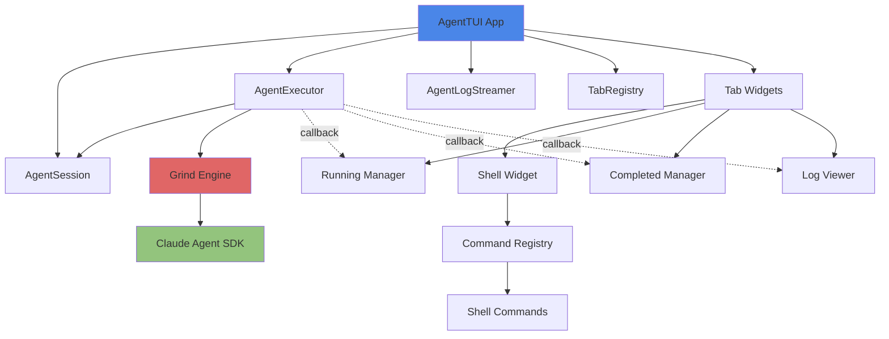

# TUI - Agent Orchestration Interface

The Grind TUI (Terminal User Interface) provides a portable, interactive interface for orchestrating and monitoring Claude AI agents in real-time.

## ⚠️ Experimental Status

**The TUI is functional but currently in alpha/experimental stage.**

**What works today:**
- ✅ **Interactive shell interface** - Fully functional with 12 commands
- ✅ **Tab navigation** - All 6 tabs accessible via keyboard shortcuts
- ✅ **Command execution** - Shell commands, history, and tab completion
- ✅ **Task loading** - Run batch tasks from YAML files via `run` command

**What's planned but not yet implemented:**
- ⏳ **Real-time agent monitoring** - Running/Completed tabs will show live agent status
- ⏳ **DAG visualization** - Dependency graph rendering in DAG tab
- ⏳ **Live log streaming** - Real-time log output in Logs tab
- ⏳ **Progress tracking** - Progress bars and iteration counts

The shell interface is fully operational and can be used to control the Grind engine. Visual monitoring features are under active development.

## Overview

### What is an Agent?

In the Grind TUI context, an **agent** refers to a single grind loop execution with metadata tracking:

- Each agent wraps a `TaskDefinition` execution (task description + verification command)
- The agent runs the fix-verify loop until the task succeeds or max iterations are reached
- `AgentInfo` tracks status, progress, logs, and results for each execution
- This abstraction provides the foundation for future multi-agent orchestration capabilities

**Example:** When you run `run tasks.yaml` with 3 tasks, the TUI creates 3 agents - one for each task - and manages their parallel/sequential execution based on dependencies.

### Purpose

The TUI is designed for:

- **Visual Monitoring**: Real-time tracking of agent execution across multiple concurrent tasks (planned)
- **Interactive Control**: Start, pause, resume, and cancel agents through a REPL shell
- **Log Streaming**: Live log output from running agents with filtering capabilities (planned)
- **Task Orchestration**: Launch batch tasks from YAML files and manage dependencies

### Key Features

- **Tabbed Interface**: Six specialized tabs for different aspects of agent management
- **Real-time Updates**: Live status updates and progress tracking
- **Log Streaming**: Watch agent logs as they execute
- **REPL Shell**: Interactive command-line for agent control
- **Keyboard Navigation**: Fast tab switching with Ctrl+1 through Ctrl+6
- **DAG Visualization**: Dependency graph for complex multi-agent tasks

### Requirements

- **Python**: 3.11 or higher
- **Terminal**: ANSI color support recommended
- **Dependencies**: Installed via `uv sync`

## Quick Start

### Launch TUI

```bash
# Basic launch
uv run grind tui

# Launch with task file
uv run grind tui -t tasks.yaml

# Launch with specific model
uv run grind tui -m opus

# Launch with verbose logging
uv run grind tui --verbose
```

### First Steps

1. **Launch the TUI**: `uv run grind tui`
2. **Navigate to Shell tab**: Press `6` or click "Shell"
3. **Get help**: Type `help` to see available commands
4. **Check status**: Type `status` to see agent overview
5. **Run tasks**: Use `run tasks.yaml` to execute a task file

## What Works Today

The TUI shell interface is fully functional with the following capabilities:

### ✅ Interactive Shell (12 Commands)

The Shell tab (press `6`) provides a complete REPL interface:

- **`help`** - Show available commands and detailed help
- **`status`** - Display agent status summary
- **`agents` / `ls`** - List all agents in the session
- **`agent <id>`** - Show detailed information about a specific agent
- **`logs <id>` / `tail <id>`** - Display recent log output for an agent
- **`run <file>`** - Start batch execution from a YAML task file
- **`spawn`** - Create a new agent interactively (partially implemented)
- **`cancel <id>`** - Cancel a running or pending agent
- **`pause <id>`** - Pause an agent at the next iteration boundary
- **`resume <id>`** - Resume a paused agent
- **`clear`** - Clear the shell output area
- **`history`** - Show command history for the session

### ✅ Tab Navigation

All six tabs are accessible and functional for navigation:

- **Agents** (`1`) - Overview placeholder
- **DAG** (`2`) - Dependency graph placeholder
- **Running** (`3`) - Active agents placeholder
- **Completed** (`4`) - Finished agents placeholder
- **Logs** (`5`) - Log streaming placeholder
- **Shell** (`6`) - Fully functional REPL

### ✅ Command Features

- **Command history** - Use ↑/↓ arrow keys to navigate previous commands
- **Tab completion** - Press Tab to autocomplete command names
- **Shell escape** - Prefix commands with `!` to execute arbitrary bash commands
- **Scrollable output** - Review command output in the shell area

### ✅ Task File Loading

The `run` command loads and executes YAML task files:

```bash
# In the Shell tab
run tasks.yaml
run examples/test-suite.yaml
```

This creates agents for each task and manages their execution based on dependencies.

## Planned Features

The following features are designed but not yet implemented:

### ⏳ Real-Time Agent Monitoring

**Running Tab:**
- Live list of actively executing agents
- Current iteration and progress percentage
- Duration and elapsed time
- Status updates as agents progress

**Completed Tab:**
- Historical record of finished agents
- Success/failure status with error messages
- Total duration and iteration counts
- Performance metrics

### ⏳ DAG Visualization

**DAG Tab:**
- Visual representation of task dependencies
- Execution flow from dependencies to dependent tasks
- Current status of each node in the graph
- Interactive navigation

### ⏳ Live Log Streaming

**Logs Tab:**
- Real-time streaming of agent log output
- Timestamps for each entry
- Filtering by specific agent ID
- Auto-scroll and search capabilities

### ⏳ Progress Tracking

**Status Display:**
- Progress bars for running agents
- Iteration counts (current/max)
- Time estimates for completion
- Resource usage metrics

## Interface Guide

### Tab Navigation

The TUI provides six specialized tabs, accessible via keyboard shortcuts:

| Tab | Shortcut | Purpose |
|-----|----------|---------|
| Agents | `Ctrl+1` or `1` | Overview of all agents in the session |
| DAG | `Ctrl+2` or `2` | Dependency graph visualization |
| Running | `Ctrl+3` or `3` | Monitor actively executing agents |
| Completed | `Ctrl+4` or `4` | View finished agents and results |
| Logs | `Ctrl+5` or `5` | Real-time log streaming from agents |
| Shell | `Ctrl+6` or `6` | REPL for orchestration commands |

### Agents Tab

The Agents tab provides a high-level overview of all agents in the current session.

**What you'll see:**
- Total agent count
- Status breakdown (pending, running, completed, failed)
- Quick reference to shell commands

**Use cases:**
- Get a quick snapshot of session state
- Understand how many agents are active
- Identify if any agents need attention

### DAG Tab

The DAG (Directed Acyclic Graph) tab visualizes task dependencies when running batch tasks from a YAML file.

**What you'll see:**
- Visual representation of task relationships
- Execution flow from dependencies to dependent tasks
- Current status of each node in the graph

**Use cases:**
- Understand task execution order
- Debug dependency issues
- Plan complex multi-task workflows

### Running Tab

The Running tab shows detailed information about currently executing agents.

**What you'll see:**
- List of active agents
- Current iteration and progress percentage
- Duration and elapsed time
- Live status updates

**Use cases:**
- Monitor long-running tasks
- Identify stuck or slow agents
- Track progress toward completion

### Completed Tab

The Completed tab displays a historical record of finished agents.

**What you'll see:**
- Tabular view of all completed agents
- Success/failure status
- Total duration and iterations used
- Error messages for failed agents

**Use cases:**
- Review task history
- Debug failures
- Analyze performance metrics

### Logs Tab

The Logs tab provides real-time streaming of agent log output.

**What you'll see:**
- Live log lines as agents execute
- Timestamps for each entry
- Filtered view for specific agents

**Use cases:**
- Debug agent behavior
- Monitor verification command output
- Watch fix attempts in real-time

### Shell Tab

The Shell tab is an interactive REPL for controlling the orchestration system.

**What you'll see:**
- Command prompt (`grind>`)
- Scrollable output area
- Command history and tab completion

**Use cases:**
- Execute orchestration commands
- Query agent status
- Control agent lifecycle (start, pause, cancel)
- Run shell commands with `!` prefix

## Shell Commands Reference

### help

Show available commands or detailed help for a specific command.

```bash
# List all commands
help

# Get help for a specific command
help agents
help spawn
```

### status

Display a summary of agent status across the session.

```bash
status
```

**Output:**
- Count of agents by status (pending, running, paused, completed, failed)
- Total agent count
- Current agent ID (if any)

### agents

List all agents in the current session.

**Aliases:** `ls`

```bash
# List all agents
agents

# Using alias
ls
```

**Output format:**
```
ID                    Status       Type         Progress  Duration
----------------------------------------------------------------------
agent-abc123          running      grind        45%       00:02:15
agent-def456          completed    grind        100%      00:01:30
```

### agent

Show detailed information about a specific agent.

```bash
agent <agent-id>
```

**Example:**
```bash
agent agent-abc123
```

**Output includes:**
- Task ID and description
- Agent type and model
- Status and iteration count
- Progress percentage
- Duration and timestamps
- Log file location
- Error messages (if any)

### logs

Display recent log output for a specific agent.

**Aliases:** `tail`

```bash
# Show last 20 lines (default)
logs <agent-id>

# Show last N lines
logs <agent-id> 50

# Using alias
tail <agent-id>
```

**Example:**
```bash
logs agent-abc123
tail agent-abc123 100
```

### run

Start batch execution from a task file.

```bash
run <task-file.yaml>
```

**Example:**
```bash
run tasks.yaml
run examples/test-suite.yaml
```

### spawn

Create a new agent interactively (not yet fully implemented).

```bash
spawn
```

**Future capabilities:**
- Prompt for task description
- Select model (haiku/sonnet/opus)
- Configure verification command
- Set max iterations

### cancel

Cancel a running or pending agent.

```bash
cancel <agent-id>
```

**Example:**
```bash
cancel agent-abc123
```

**Notes:**
- Only works on agents with status: pending, running, or paused
- Cancellation is graceful (waits for current iteration)

### pause

Request a pause at the next iteration boundary.

```bash
pause <agent-id>
```

**Example:**
```bash
pause agent-abc123
```

**Notes:**
- Agent will pause after completing current iteration
- Use `resume` to continue execution

### resume

Resume a paused agent.

```bash
resume <agent-id>
```

**Example:**
```bash
resume agent-abc123
```

### clear

Clear the shell output area.

```bash
clear
```

### history

Show command history for the current session.

```bash
history
```

**Output format:**
```
   1  help
   2  status
   3  agents
   4  run tasks.yaml
```

### Shell Escape

Execute arbitrary shell commands by prefixing with `!`.

```bash
# Run any shell command
!ls -la
!git status
!pytest tests/
!ruff check .

# Examples
!cat /tmp/agent-logs/agent-abc123.log
!grep "ERROR" logs/*.log
```

**Notes:**
- Commands timeout after 30 seconds
- Exit codes are displayed
- Use caution with destructive commands

## Known Limitations

The TUI is under active development. Current limitations:

### Tab 1 (Agents Overview)
- Shows placeholder text only
- Real-time agent list not yet implemented
- Planned: Live grid of all agents with status/progress

### Tab 2 (DAG Visualization)
- Shows placeholder text only
- DAG rendering not yet implemented
- Planned: Visual dependency graph with execution flow

### Tab 3 (Running Agents)
- ListView widget exists but not populated
- Real-time updates not wired
- Planned: Live list with progress bars

### Tab 4 (Completed Agents)
- DataTable widget exists but not populated
- Historical data not tracked
- Planned: Searchable history with filters

### Tab 5 (Logs)
- StreamingLogViewer widget exists
- Log streaming not fully wired
- Planned: Real-time log tailing with search/filter

### Tab 6 (Shell) ✅
- **Fully functional** - all features work
- 12 commands implemented and tested
- Command history and completion working

### What You Can Do Today

Use the Shell tab (press 6) to:
- Run batch task files: `run tasks.yaml`
- Create agents interactively: `spawn`
- Check status: `status`, `agents`
- View logs: `logs <agent-id>`
- Execute bash: `!ls -la`

The shell provides full orchestration control even though
the monitoring tabs are still in development.

## Keyboard Shortcuts

### Global Shortcuts

| Key | Action | Description |
|-----|--------|-------------|
| `1` | Switch to Agents | Overview tab |
| `2` | Switch to DAG | Dependency graph |
| `3` | Switch to Running | Active agents |
| `4` | Switch to Completed | Finished agents |
| `5` | Switch to Logs | Log streaming |
| `6` | Switch to Shell | REPL interface |
| `q` | Quit | Exit the TUI |

### Shell Tab Shortcuts

| Key | Action | Description |
|-----|--------|-------------|
| `↑` | Previous command | Navigate command history backward |
| `↓` | Next command | Navigate command history forward |
| `Tab` | Autocomplete | Complete command names |
| `Ctrl+C` | Cancel/Clear | Clear input or interrupt |
| `Esc` | Hide completions | Dismiss completion popup |
| `Enter` | Submit command | Execute the current command |

### Navigation Tips

- Use number keys (`1`-`6`) for instant tab switching
- Arrow keys for command history in Shell tab
- Tab completion works for all command names and aliases
- `Ctrl+C` in Shell clears input without exiting

## Configuration

### Default Model

Set the default model for new agents:

```bash
# Launch with specific model
uv run grind tui -m opus
uv run grind tui -m sonnet
uv run grind tui -m haiku
```

**Cost vs Quality trade-offs:**
- **haiku**: Fast and cheap, good for simple tasks
- **sonnet**: Balanced performance (default)
- **opus**: Highest quality for complex problems

### Log Output Location

Agent logs are stored in:
```
/tmp/agent-logs/<agent-id>.log
```

View logs:
```bash
# In Shell tab
logs <agent-id>

# Or use shell escape
!cat /tmp/agent-logs/<agent-id>.log
!tail -f /tmp/agent-logs/<agent-id>.log
```

### Max Parallel Agents

Currently, parallelism is controlled by the task file:

```yaml
tasks:
  - task: "Task 1"
    verify: "pytest test1.py"
    dependencies: []

  - task: "Task 2"
    verify: "pytest test2.py"
    dependencies: []  # Runs in parallel with Task 1

  - task: "Task 3"
    verify: "pytest test3.py"
    dependencies: ["Task 1", "Task 2"]  # Waits for both
```

**Future:** Global max_parallel setting planned.

## Architecture

### Component Relationships



### Reactive Pattern

The TUI uses a **callback-based reactive pattern** for real-time updates:

1. **AgentExecutor** runs agents asynchronously via the Grind engine
2. **Callbacks** fire on status changes and log events
3. **Widgets** receive callbacks and update their display
4. **Textual framework** handles efficient terminal rendering

**Key benefits:**
- No polling required
- Instant UI updates
- Low CPU overhead
- Scalable to many concurrent agents

### Integration with Grind Engine

The TUI is a **thin orchestration layer** over the core Grind engine:

```python
# Core components
session = AgentSession()      # Tracks all agents
executor = AgentExecutor()     # Runs agents via Grind
log_streamer = AgentLogStreamer()  # Streams logs

# Execution flow
executor.run_agent(task) → grind.engine.run() → Claude Agent SDK
```

**Separation of concerns:**
- **TUI**: User interface, monitoring, control
- **Grind Engine**: Fix-verify loop logic
- **Agent SDK**: Claude API integration

This design allows the same tasks to run via CLI or TUI interchangeably.

## Troubleshooting

### TUI won't start

**Symptom:** Error on launch or blank screen

**Solutions:**
1. Check Python version: `python --version` (need 3.11+)
2. Reinstall dependencies: `uv sync`
3. Check terminal compatibility: Ensure ANSI support
4. Try verbose mode: `uv run grind tui --verbose`

### Agents not showing up

**Symptom:** Spawned agents don't appear in tabs

**Solutions:**
1. Check Shell tab for error messages
2. Verify task file syntax: `uv run grind validate tasks.yaml`
3. Switch to Running tab (press `3`)
4. Use `agents` command in Shell to list all agents

### Logs not streaming

**Symptom:** Logs tab is empty or not updating

**Solutions:**
1. Verify agent is running: `status` in Shell tab
2. Check log file exists: `!ls /tmp/agent-logs/` in Shell
3. Use `logs <agent-id>` command directly
4. Switch away and back to Logs tab to refresh

### Shell commands not working

**Symptom:** Commands return errors or "not found"

**Solutions:**
1. Type `help` to see available commands
2. Check command syntax: `help <command>`
3. Ensure you're in Shell tab (press `6`)
4. For shell escapes, use `!` prefix: `!ls` not `ls`

### High CPU usage

**Symptom:** TUI consumes excessive CPU

**Solutions:**
1. Limit concurrent agents in task file
2. Close unused tabs
3. Reduce log verbosity
4. Use CLI mode for headless operation

### Display corruption

**Symptom:** Garbled text or rendering issues

**Solutions:**
1. Resize terminal window
2. Press `Ctrl+L` to force redraw (in some terminals)
3. Restart the TUI
4. Update terminal emulator
5. Check `$TERM` environment variable

### Debug Logging

Enable verbose logging for troubleshooting:

```bash
# Launch with verbose flag
uv run grind tui --verbose

# Check log output location
!ls -l /tmp/agent-logs/

# View TUI internal logs (if available)
!cat /tmp/grind-tui.log
```

### Async Event Loop Issues

**Symptom:** TUI hangs or becomes unresponsive, especially during agent execution

**Background:** The TUI runs in an async event loop (Textual framework) and must properly coordinate with the Grind engine's async operations.

**Solution Applied:**
- The codebase includes fixes for proper async/await handling in agent execution
- `AgentExecutor` now correctly manages asyncio tasks and callbacks
- Event loop coordination between Textual and agent runtime has been improved

**If you still encounter issues:**
1. Ensure you're running the latest version: `git pull && uv sync`
2. Check for Python version compatibility (3.11+ required)
3. Report the issue with verbose logs: `uv run grind tui --verbose`

## Advanced Usage

### Monitoring Long-Running Tasks

For tasks that run for hours:

1. Launch TUI with task file: `uv run grind tui -t long-tasks.yaml`
2. Switch to Running tab (`3`) to monitor progress
3. Use Logs tab (`5`) to watch detailed output
4. Check Completed tab (`4`) periodically for finished agents
5. Use `status` command for quick overview

### Parallel Task Execution

Structure task files for parallelism:

```yaml
tasks:
  # These run in parallel (no dependencies)
  - task: "Fix linting"
    verify: "ruff check ."

  - task: "Fix type errors"
    verify: "mypy ."

  - task: "Fix test failures"
    verify: "pytest tests/"

  # This waits for all above to complete
  - task: "Integration test"
    verify: "pytest integration/"
    dependencies:
      - "Fix linting"
      - "Fix type errors"
      - "Fix test failures"
```

### Custom Shell Workflows

Combine commands for power workflows:

```bash
# Monitor specific agent
agent agent-abc123
logs agent-abc123 50
!tail -f /tmp/agent-logs/agent-abc123.log

# Bulk operations
!ls /tmp/agent-logs/ | wc -l  # Count total agents
!grep -l "ERROR" /tmp/agent-logs/*.log  # Find failed logs

# Status checking loop
!watch -n 5 "echo 'status' | uv run grind tui"  # Not recommended, use TUI directly
```

## See Also

- **[Getting Started](getting-started/quickstart.md)** - Installation and setup
- **[User Guide](guide/features.md)** - Complete feature reference
- **[Architecture](architecture/overview.md)** - System design
- **[Slash Commands](guide/slash-commands.md)** - Slash command reference

## Feedback

The TUI is under active development. Report issues or suggest features:

- [GitHub Issues](https://github.com/eddiedunn/claude-code-agent/issues)
- Tag with `tui` label
